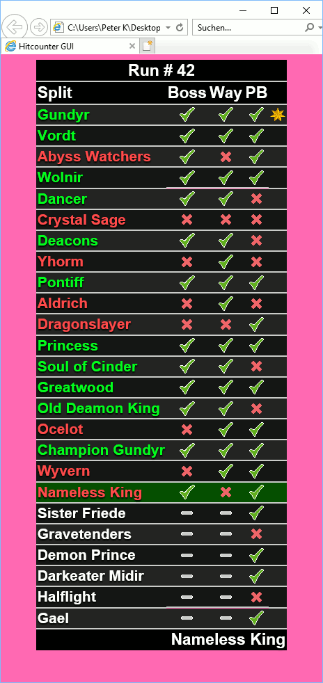

# HitCounterManager - A Dark Souls inspired Hit Counter

**Free Hit Counter** that is running in the background, so you can focus on your stream.  
No need to keep any windows open for a window capture any more.  
Initially designed for Dark Souls and similar games but supports any game.  
Just add the local HTML file to you broadcasting software and the setup is done.  
**Works completely offline, no account or login required.**

To see some **screenshots** of this application go to the **[Wiki pages](../../wiki)**.  
To see **how to** use the application watch the **[Tutorial on YouTube](https://www.youtube.com/watch?v=iXGExlS4xeM)**.

## Key-Features

* Offline application
* No window capture needed for stream integration
* Hot key support for seamless use **ingame** (Windows only)
* Easy to use profile management
* On the fly configurable design

### Features in detail

* Configurable keyboard hot keys can be used while running fullscreen games (like Dark Souls III):
  * Increase/Decrease hit count of the current split (boss hits and hits on the way separately)
  * Go to next/previous split
  * Reset the run (sets all hit counts to 0 and selects first split)
  * Save the run as your PB (personal best)
* One single save file: **HitCounterManagerSave.xml**
  * Holds all your settings, profiles and is designed to work in newer/upcoming versions, too. Save and restore this file at any time.
* Create profiles for each challenge or game
  * Keeps the current progress and your personal bests saved
  * Keep track of each profile how many runs/attempts your already started
  * Multiple profiles can be created and switched very easily (e.g. multiple games for Dark Souls trilogy runs)
    * Switching to other profiles will remember the hit counts of the currently selected profile
* Build easy customizable succession, e.g. _Dark Souls Trilogy_
* Keep track of furthest progress in the current session

### Pre-defined profiles

* Bloodborne + The old hunters
* Dark Souls 1 Prepare To Die Edition
* Dark Souls 2
* Dark Souls 3 + Ashes of Ariandel + The Ringed City
* Demon's Souls
* Salt and Sanctuary
* Sekiro
* The Surge + A walk in the park
* The Surge 2

### Design configurations

The appearance of all designs can be modified via GUI on the fly:  
> Updates run with an interval of 1.5 seconds to spare performance  
> Previews can be found at the **[Wiki pages](../../wiki)**.

* Purpose
  
  * Act as split counter _(traditional no hit runs)_
  * Death counter _(Very basic death counter)_
  * Checklist _(Simple boss or split checklist)_
* Choose severity of hits _(ends up in differnt split colors)_
  
  * Any hit counts as a critical hit
  * Boss hits are critical, hits on the way count normal
  * Splits having hits less than PB count normal, otherwise critically
* Appearance
  
  * Show/Hide amount of runs that has already been started
  * Show/Hide the headline and/or footer
  * Show/Hide the session progress icon
  * Show/Hide progress bar
  * Show the hits separately or as a combination of boss hits and hits on the way
  * Show numbers or images to represent hits
  * Show/Hide the personal best
* Readability _(e.g. for lower bitrates or mobile devices)_
  
  * Limit the visible splits when you have lots of splits
  * Enable/Disable transparency
  * Enable/Disable colored split names
  * Enable/Disable superscripted PB sum
  * Enable/Disable roman numerals
  * Enable/Disable highlighting of current split
* Custom design
  
  * Switch to a different font
  * Choose an alternative CSS file _(pink colored alternative available)_

## Get the software
All available releases can be found at the [Releases page](../../releases) on GitHub.

## Installation

### Systemrequirements
* OS: Windows Vista, Windows Server 2003 or newer (32/64 bit)
  * Portable version (ZIP)
    * [.Net Framework 2.0 or newer](https://www.microsoft.com/net)
    > Note: Version 1.13 and older requires [.Net Framework 4.5 or newer](https://www.microsoft.com/net)
  * Installer version (Setup)
    * [.Net Framework 4.5 or newer](https://www.microsoft.com/net)
* OS: Any (32/64 bit)
  * Portable version (ZIP)
    * [Mono](https://www.mono-project.com/) (_tested with 5.14.0_)  
      Run the application in the application's directory with **mono HitCounterManager.exe**  
      **Note**: The Non-Windows / Mono version does not support global hot keys

### Designs / Fonts

A specific font can be selected at the appearance dialog in two ways:
* The font is already installed locally on the system
  * _(Not required but recommended)_ Clear the field for the font URL as no external font must be loaded
  * Enter your font family name of choice at the font name field and hit Apply
  > Example: _sans-serif_ or _courier_
* The font is **not** installed locally and must be loaded from an external _@font-face_ ressource
  * Enter the URL to the ressource into the font URL field
  * Enter the matching font family name at the font name field and hit Apply
  > Example: URL _https://fonts.googleapis.com/css?family=Fontdiner+Swanky_ and name _Fontdiner Swanky_

To find suitable fonts I can recommend Google's font collection: [https://fonts.google.com](https://fonts.google.com).  
Search for one of your liking and see the embedded font and/or CSS instruction as you can simply copy URL and name from there into the application. For the previous example the instructions looked like this _(the part to copy in bold)_:
> URL from Embed Font instructions:  
> _&lt;link href="**https://fonts.googleapis.com/css?family=Fontdiner+Swanky**" rel="stylesheet"&gt;_  
> Name from CSS instructions:  
> _font-family: '**Fontdiner Swanky**', cursive;_

## Setting up Broadcasting software

### Streamlabs OBS (SLOBS)
* Add a **Browser Source** to your scene
* Check the **Local file** checkbox
* Insert the HTML's filepath of a design file into the **Local File** field.
> Example: _C:\MyHitCounter\Designs\HitCounterNumeric.html_  
> Note: It was tested with some beta versions up to 0.11.1, so the instruction _may_ change in newer versions.

### OBS Studio
* Add a **Browser Source** to your scene
* Insert the HTML's filepath of a design file into the **URL** field including this prefix that allows access to local files: **http://absolute/**
> Example: _http://absolute/C:/MyHitCounter/Designs/HitCounterNumeric.html_

### Open Broadcaster Software (OBS, _not_ OBS Studio!)
* Add a **CLR Browser** to your scene
* The opacity can be set to 100% because the background will be rendered transparent, so no color-keying is required.
* Insert the HTML's filepath of a design file into the **URL** field.
> Example: _C:\MyHitCounter\Designs\HitCounterNumeric.html_
* If you experience troubles with the rendering of the HTML file (flickering or misplacement), try removing the CSS overrides of the CLR Brower instance.
* When no data is displayed, there could be a problem with the cross-domain security settings. This is because the HTMLs are rendered via file:// protocol instead of http://, so maybe you need to change some deeper settings of the CLR browser under _OBS -> Settings -> Browser -> Instance -> ..._
    * FileAccessFromFilesUrls (Set to **Enabled**)
    * UniversialAccessFromFilesUrls (Set to **Enabled**, _but should also work when disabled_)
    * WebSecurity (Set to **Disabled**, _but should also work when enabled_)

### Twitch Studio Beta
* Tested with version v0.74.3: When added an embedded website and configured the *HitCounterGui.html* it shows an error during the loading process. Twitch is looking at this problem as a bug report was issued and also communicated via discord. In future versions this should work as intended without coniguration of any additional settings.
> Workaround: When the application *(TwitchStudio)* starts the hit counter loads correctly. A refresh or the initial creation seems to have issues only. So, restarting the software may work for now, as long as the configuration/scenes/layers are not beeing modified.

## Modders and developers

### Using standalone web browser instead of broadcasting software
* When no data is displayed, there could be a problem with cross-domain security settings that can be avoided by allowing acces to local files in general:
  * **Chrome**
    * Start with command line option **--allow-file-access-from-files**
    > Example: _"C:\Program Files (x86)\Google\Chrome\Application\chrome.exe" --allow-file-access-from-files_
  * **Firefox**
    * Change the security policy in the browser settings **about:config -> security.fileuri.strict_origin_policy -> false**
    > Note: This is a global settings, means you should enable this only for offline/trusted websites!
  * **Internet Explorer 11**
    * Accepting the initially blocked execution of the script should be sufficient
  * **Edge**
    * No issues here so far

### Changing layout and design
You can modify or create new custom designs. Simply modify or create a new HTML, CSS or Javascript files based on any of the pre-delivered designs. For example, the style like **background color, font color or sizes can be easily modified in the CSS files**.  
You can modify the [HitCounter.template](Sources/HitCounter.template) which comes with the installation or you can create an own template file to set custom settings for your designs at a single location.  
> The application is using JavaScript syntax when writing data into the output file. Therefore the template has to have a line with the text **HITCOUNTER_LIST_START** which is the starting mark. The mark with all further lines will be replaced with the JavaScript equivalent of the application's current data. This replacement is done until the **HITCOUNTER_LIST_END** text mark is reached.  
Eventually it means **you are 100% free in the design of your hit counter**.  

## Anything is missing, something is annoying/can be improved or you just found a bug?
Message me via GitHub / e-mail or simply open an issue and I will try to help you out. Alternatively you can also send me a whipser on Twitch: [GeneralGunrider](https://www.twitch.tv/generalgunrider)

## Special thanks
I would never have created this tool without the inspiration by watching the awesome 0 hit and no death runners...  
Thanks to (in alphabetical order):
* [CouchJockey](https://www.twitch.tv/couchjockey)
* [Dinossindgeil](https://www.twitch.tv/dinossindgeil)
* [DonnyRekt](https://www.twitch.tv/donnyrekt)
* [FaraazKhan](https://www.twitch.tv/faraazkhan)
* [Kazoodle](https://www.twitch.tv/kazoodle)
* [Sayvi](https://www.twitch.tv/sayvi)
* [SlipperySuzie](https://www.twitch.tv/slipperysuzie)
* [Soldi](https://www.twitch.tv/soldi)
* [SquillaKilla](https://www.twitch.tv/squillakilla)
* [The_Happy_Hob](https://www.twitch.tv/the_happy_hob)
* [TigerG92](https://www.twitch.tv/tigerg92)
* Every member of the [Hitless team on Twitch](https://www.twitch.tv/team/hitless)
* Every contributor and contestor of the [German No Hit League](https://www.dinossindgeil.de)
* And also all the other great challenge runners out there that I cannot name here all.
  
> Praise the sun!  :sunny: . . . :fire: . . .  :running: :dash: 
