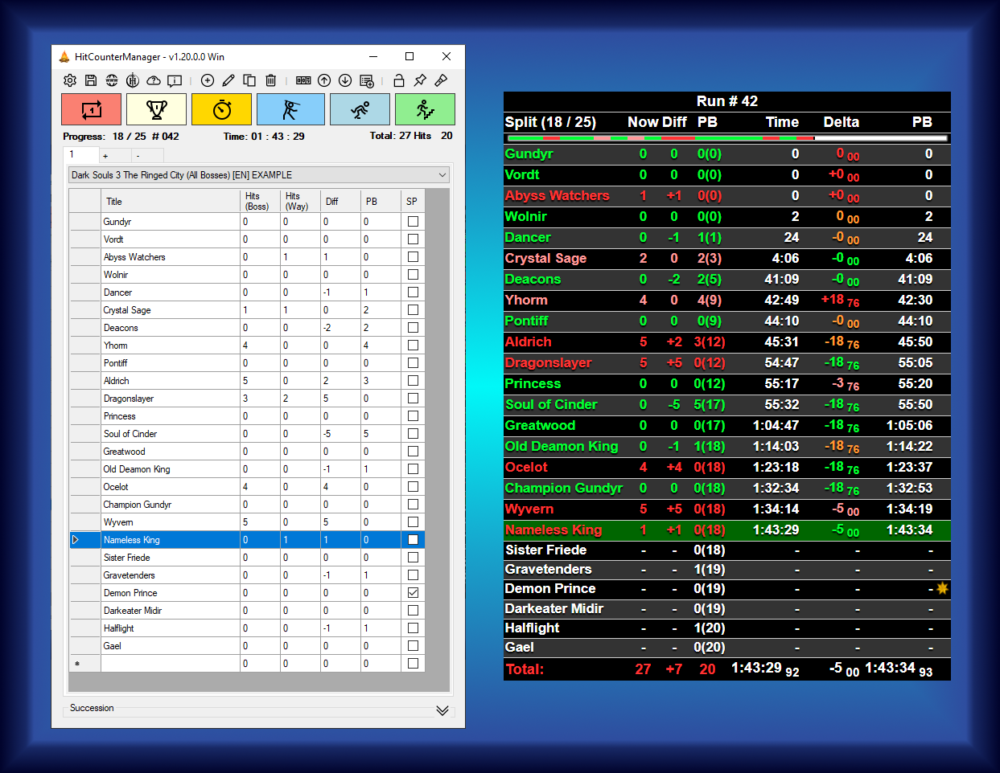

# HitCounterManager - A Dark Souls inspired Hit Counter

** :bangbang: THIS IS A DEVELOPMENT BRANCH, ANYTHING MAY CHANGE AT ANY TIME :bangbang: **  
** :bangbang: THE STABLE BRANCH IS `master` :bangbang: **  

  

**Free Hit Counter** that is running in the background, so you can focus on your stream.  
No need to keep any windows open for a window capture any more.  
Initially designed for Dark Souls but supports any game.  
Just add the local HTML file to you broadcasting software and the setup is done.  
**Works completely offline, no account or login required.**

## Key-Features

* Offline application
* No window capture needed for stream integration
* Hot key support for seamless use **ingame** (Windows only)
* Easy to use profile management
* On the fly configurable design
* Configurable keyboard hot keys that can easily be used while playing
* One single save file for all settings and profiles: **HitCounterManagerSave.xml**
  > Note: The settings will be kept when upgrading on newer versions.
  > I try my best keeping it backwards compatible that you can still load an upgraded save file on older versions.
* Create profiles for each challenge or game or build a sequence of runs (called succession) like for the Dark Souls trilogy
* Dark Mode
* Timer (including current, PB and gold split times)
* Customizable designs (Find [some examples](../../wiki/Designs) at the [Wiki pages](../../wiki))

### Pre-defined profiles

* Bloodborne + The old hunters
* Celeste
* Crash Bandicoot 1
* Crash Bandicoot 2
* Crash Bandicoot 3
* Crash Bandicoot 4
* Cuphead
* Dark Souls 1 Prepare To Die Edition
* Dark Souls 2
* Dark Souls 3 + Ashes of Ariandel + The Ringed City
* Demon's Souls
* Elden Ring
* Hades
* Hollow Knight
* Mortal Shell
* Salt and Sanctuary
* Sekiro
* The Surge + A walk in the park
* The Surge 2

## Get the software
All available releases can be found at the [Releases page](../../releases) on GitHub.

## Addons
There are addons available now, e.g.:
* The LiveSplit plugin [**LiveSplit.HitCounterManagerConnector**](https://github.com/topeterk/LiveSplit.HitCounterManagerConnector)
  * Automatically selecting the HCM splits and restarts a new run when LiveSplit is doing so either due to AutoSplitter or manual input.
* The HitCounterManager plugin [**AutoSplitterCore for HCM**](https://github.com/neimex23/HitCounterManager)
  * Adds AutoSplitting and InGameTime directly into HitCounterManager without requiring LiveSplit

## Systemrequirements
* Operating System:
  * **Including** global hot key support:
    * Windows 10, Windows Server 2012 or newer
  * **Without** global hot key support:
    * Most Linux variants like Alpine 3.18+, CentOS 9+, Debian 12+, Fedora 40+, Ubuntu 20.04+, Red Hat Enterprise Linux 8+ (only tested on Ubuntu)
    * macOS 14.2+
    * Android 34+
  * **Maybe** coming later (at least I try)
    * iOS 17.2+ _(most likely not running yet)_
* Prerequisites:
  * [.NET 8.0 Runtime](https://dotnet.microsoft.com/download/dotnet/8.0/runtime) or newer, see [supported OS versions](https://github.com/dotnet/core/blob/main/release-notes/8.0/supported-os.md)
  * On Android:
    * As not provided via Google Play Store: [allow installation of unknown apps](https://developer.android.com/studio/publish#publishing-unknown)

Please have a look at the _v2.x_ branch or find *pre-compiled development builds* [here](../../issues/21) or [here](https://dev.azure.com/topeterk/HitCounterManager/_build).

## Installation, Guides, Help
Please have a look at the **[Wiki pages](../../wiki)**, the **[Setup Guide](../../wiki/SetupGuide)** or the [FAQ](../../wiki/SetupGuide#FAQ).

## Community
There is a great growing community on Discord called [Team Hitless](https://discord.gg/4E7cSK7).
If you are seeking for help, guidance or just talk about no hit runs, this is the right place for it.  
Thanks to everyone for helping other community members!

To learn more about Team Hitless you can also have a look at the [website](https://www.teamhitless.com).

## Contact
If you are seeking for help, I can proudly suggest that you will most likely get good help on the [Team Hitless](https://discord.gg/4E7cSK7) discord (preferrably the _#hitless-tech channel).  
For feature suggestions or bugs I would recommend that you open up an issue on GitHub.  
Alternatively you can also message me on [Twitch - GeneralGunrider](https://www.twitch.tv/generalgunrider) or [YouTube GeneralGunrider](https://www.youtube.com/watch?v=iXGExlS4xeM&list=PLvBCl9o55PB7BYB7vXVxQuP5J27X_XXzm).

## Special thanks
I would never have created this tool without the inspiration by watching the awesome 0 hit and no death runners...  
Thanks to (in alphabetical order):
* [CouchJockey](https://www.twitch.tv/couchjockey)
* [Dinossindgeil](https://www.twitch.tv/dinossindgeil)
* [DonnyRekt](https://www.twitch.tv/donnyrekt)
* [FaraazKhan](https://www.twitch.tv/faraazkhan)
* [Sayvi](https://www.twitch.tv/sayvi)
* [SlipperySuzie](https://www.twitch.tv/slipperysuzie)
* [Soldi](https://www.twitch.tv/soldi)
* [SquillaKilla](https://www.twitch.tv/squillakilla)
* [The_Happy_Hob](https://www.twitch.tv/the_happy_hob)
* [TigerG92](https://www.twitch.tv/tigerg92)
* [Zoodle](https://www.twitch.tv/zoodle)
* Every member of the [Hitless team on Twitch](https://www.twitch.tv/team/hitless)
* And also all the other great challenge runners out there that I cannot name here all.
  
> Praise the sun!  :sunny: . . . :fire: . . .  :running: :dash: 
