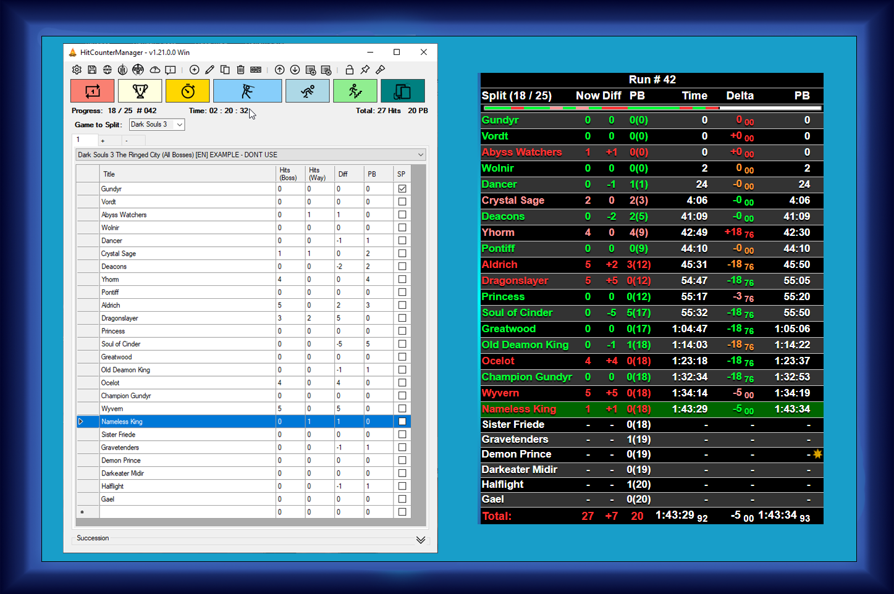

# HitCounterManager - A Dark Souls inspired Hit Counter

**Free Hit Counter** that is running in the background, so you can focus on your stream.  
No need to keep any windows open for a window capture any more.  
Initially designed for Dark Souls but supports any game.  
Just add the local HTML file to you broadcasting software and the setup is done.  
**Works completely offline, no account or login required.**

## Key-Features

* Offline application
* No window capture needed for stream integration
* Hot key support for seamless use **ingame** (Windows only)
* Easy to use profile management
* On the fly configurable design
* Configurable keyboard hot keys that can easily be used while playing
* One single save file for all settings and profiles: **HitCounterManagerSave.xml**
  > Note: The settings will be kept when upgrading on newer versions.
  > I try my best keeping it backwards compatible that you can still load an upgraded save file on older versions.
* Create profiles for each challenge or game or build a sequence of runs (called succession) like for the Dark Souls trilogy
* Dark Mode (not the best looking but hey: its dark)
* Timer (including current, PB and gold split times)
* Customizable designs (Find [some examples](../../wiki/Designs) at the [Wiki pages](../../wiki))

### Pre-defined profiles

* Bloodborne + The old hunters
* Dark Souls 1 Prepare To Die Edition
* Dark Souls 2
* Dark Souls 3 + Ashes of Ariandel + The Ringed City
* Demon's Souls
* Elden Ring
* Salt and Sanctuary
* Sekiro
* The Surge + A walk in the park
* The Surge 2
* Mortal Shell
* Celeste
* Crash Bandicut 1 
* Crash Bandicut 2
* Crash Bandicut 3
* Crash Bandicut 4
* Cuphead
* Hades
* Hollow Knight

## Get the software
All available releases can be found at the [Releases page](../../releases) on GitHub.  

## Systemrequirements
* OS: Windows Vista, Windows Server 2003 or newer (64 bit)
  * Portable version (ZIP)
    * [.Net Framework 2.0 or newer](https://www.microsoft.com/net)
    > **Note**: Version 1.13 and older requires [.Net Framework 4.5 or newer](https://www.microsoft.com/net)
  * Installer version (Setup)
    * [.Net Framework 4.8 or newer](https://www.microsoft.com/net)
    > **Note**: Version 1.21 and older requires [.Net Framework 4.5 or newer](https://www.microsoft.com/net)
* OS: 64 bits
 

## Installation, Guides, Help
Please have a look at the **[Wiki pages](../../wiki)**, the **[Setup Guide](../../wiki/SetupGuide)** or the [FAQ](../../wiki/SetupGuide#FAQ).

## Anything is missing, something is annoying/can be improved or you just found a bug?
Message me via GitHub / e-mail or simply open an issue and I will try to help you out. Alternatively you can also send me a whipser on Twitch: [GeneralGunrider](https://www.twitch.tv/generalgunrider)

## Community
There is a great growing community on Discord called [Team Hitless](https://discord.gg/4E7cSK7).
If you are seeking for help, guidance or just talk about no hit runs, this is the right place for it.  
Thanks to everyone for helping other community members!

## Special thanks
I would never have created this tool without the inspiration by watching the awesome 0 hit and no death runners...  
Thanks to (in alphabetical order):
* [CouchJockey](https://www.twitch.tv/couchjockey)
* [Dinossindgeil](https://www.twitch.tv/dinossindgeil)
* [DonnyRekt](https://www.twitch.tv/donnyrekt)
* [FaraazKhan](https://www.twitch.tv/faraazkhan)
* [Kazoodle](https://www.twitch.tv/kazoodle)
* [Sayvi](https://www.twitch.tv/sayvi)
* [SlipperySuzie](https://www.twitch.tv/slipperysuzie)
* [Soldi](https://www.twitch.tv/soldi)
* [SquillaKilla](https://www.twitch.tv/squillakilla)
* [The_Happy_Hob](https://www.twitch.tv/the_happy_hob)
* [TigerG92](https://www.twitch.tv/tigerg92)

Thanks to Beta Testers of AutoSplit(in alphabetical order):
* [DanielloPiuBello](https://www.twitch.tv/daniellopiubello)
* [OlallaZ2](https://www.twitch.tv/olallaz2)
* [Bajamuten](https://www.twitch.tv/bajamuten)
* [Zirob21](https://www.twitch.tv/zirob21)
* [Empaventuras](https://www.twitch.tv/empaventuras)
* [Slash15](https://www.twitch.tv/slash15_)

* Every member of the [Hitless team on Twitch](https://www.twitch.tv/team/hitless) and [No Hit Hispano on Twitch](https://www.twitch.tv/nohithispano)
* And also all the other great challenge runners out there that I cannot name here all.
  
> Praise the sun!  :sunny: . . . :fire: . . .  :running: :dash: 
